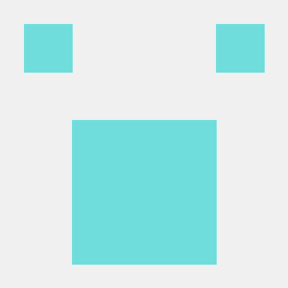

# JAVA_STUDY

## 규칙

- 각자 문제 풀고 자기 이름의 폴더에 풀이 올리기

- 문제풀이여부 - 해당 과제 문제 에 본인 이미지로 푼것 체크하기!

- 다른 사람의 코드에 의견을 제시하고 싶을 경우 { 상대방이름 } \_ { 자기이름 }의 branch 생성 후 PR하기

- 과제 commit시 commit msg로 꼭 작성날짜 입력해주기

  - ex) '2021-10-19 블랙잭'

- cf) 1초가 걸리는 입력의 크기

  • O(N):10^8

- How to push

  - git 생성

    1. git clone https://github.com/cano721/JAVA_STUDY.git

  - local에 받아진 폴더에서 파일 수정
    1. git add .
    2. git commit -m '커밋 메시지'
    3. git pull origin main
    4. git push origin main (본인 깃헙 계정으로)

- 백준 solved.ac 추가하는 법

  - solved.ac란? -> 백준 난이도 측정기 (Chrome 확장 프로그램)
  - Chrome 확장프로그램 -> 웹스토어에서 solved.ac 검색 후 설치
    

**[안산학생님 방식 스터디 진행]**

- 문제출제순서(2일단위 카톡 알림)

  - cano721 -> bear1230 -> jeeyani -> HoYoon-Lee -> YHT
  - -> 1223gogo -> paul  -> rave189 -> egg528 -> bo-yoon

- 문제 출제 / 제출 기한
  - 20시 ~ 23시 사이에 출제
  - 문제 제출(문제풀이여부.md에 낼것)
  - 제출기한 : 출제 마감 시간 다음날 08시로 설정(32시간)
- 문제 출제
  - 백준 기준 실버X~골드X
  - 브루트포스,재귀(백트래킹), DFS & BFS, 우선순위큐, 투포인터&슬라이딩 윈도우, DP
  - 다익스트라&벨만포드&플로이드워셜, 유니온파인드, MST(크루스칼,프림)
- 토의시간(참여 가능한 사람만)
  - 매주 일요일 20시
  - Discord 통해서 진행
  - 다음주 개념과 이번주 문제 풀이 공유
- 벌금
  - 한 문제라도 미제출 시 벌금 2000원
  - 못 푸는 것이 아닌 안 푸는 것에 대한 벌금입니다.
  - 못 풀 시, 풀려고 시도했던 코드 혹은 필기 인증부탁드려요.
  - 아프시면 진료비/약값 영수증 확인으로 PASS 됩니다.
  - 수험표 인증 시 시험 전 날 PASS 됩니다.
  - 본인 생일 시 PASS 됩니다. (생일선물)
  - 카카오뱅크 모임통장으로 투명하게 운영하겠습니다.
  - 벌금은 매달 말일에 정확하게 N분의 1로 보내드리겠습니다!
  - 말일 전, 중도 하차는 보내드릴 수 없습니다 ㅠㅠㅠ
- PASS권 안내
  - 매 월 2회 PASS 이용권 사용가능!
  - 가능하면 급한 일정이 잡혔을 때 사용 바랍니다!
  - 매 월 2회만 사용가능 하며, 이월 되지 않습니다!
  - 월 1일에 초기화 됩니다.

**[12월 패스권 사용]**

1. 1223gogo, egg528, paul, bo-yoon, yht0827, bear1230, jeeyani, cano721 , rave189
2. egg528, 1223gogo, paul, bo-yoon, bear1230, yht0827, cano721, jeeyani

### 참가자

---

- (cano721) - 

  - 사용가능 언어 : 중 - Python / 하 - Java,C++,Kotlin
  - Contact : cano721@naver.com

- (egg528) - 

  - 사용가능 언어: 중 - Java, Python
  - Contact: rnjsdntjr26@daum.net

- (bear1230) - 

  - 사용가능 언어: 중 - C++, C# / 하 - Java, Python
  - Contact: oioifor@naver.com

- (jeeyani) - 

  - 사용가능 언어: 중 - Java, 하 - C++
  - Contact: jeeyeon27@naver.com

- (HoYoon-Lee) - 

  - 사용가능 언어: 중 - Java, C, Python / 하 - Kotlin, C++, Javascript
  - Contact: happylhy0630@naver.com

- (yht0827) - 

  - 사용가능 언어: 중 - Java / 하 - Python
  - Contact: yangheetae0827@naver.com

- (1223gogo) - 

  - 사용가능 언어: 중 - Java, C++, JavaScript / 하 - python
  - Contact: 1223gogo@naver.com

- (paul) - 

  - 사용가능 언어: 중 - Java, C++
  - Contact: pdh5056@gmail.com

- (bo-yoon) - 
  - 사용가능 언어:
  - Contact: 
- (rave189) - 
  - 사용가능 언어: 중 - Java
  - Contact: rave189@naver.com
