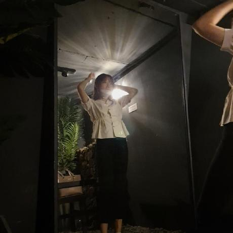

# 자바 알고리즘             

## 브루트포스

* [A+B-7](https://www.acmicpc.net/problem/11021)      
* [블랙잭](https://www.acmicpc.net/problem/2798)     
* [한수](https://www.acmicpc.net/problem/1065)       
* [덩치](https://www.acmicpc.net/problem/7568)       
* [체스판 다시 칠하기](https://www.acmicpc.net/problem/1018)        
* [오르막길](https://www.acmicpc.net/problem/2846)        
* [사탕게임](https://www.acmicpc.net/problem/3085)           
* [날짜계산](https://www.acmicpc.net/problem/1476)         
* [팰린드롬 만들기](https://www.acmicpc.net/problem/1254)        
* [분해합](https://www.acmicpc.net/problem/2231)        
* [영화감독숌](https://www.acmicpc.net/problem/1436)        

* [일곱 난쟁이](https://www.acmicpc.net/problem/2309)        

## 구현

* [그룹단어체커](https://www.acmicpc.net/problem/1316)          

## 백트래킹(재귀)

* [피보나치 수 5](https://www.acmicpc.net/problem/10870)        
* [N과M(2)](https://www.acmicpc.net/problem/15650)      
* [스타트와링크](https://www.acmicpc.net/problem/14889)     
* [로또](https://www.acmicpc.net/problem/6603)      

- [하노이 탑 이동 순서](https://www.acmicpc.net/problem/11729)        

* [부분수열의 합](https://www.acmicpc.net/problem/1182)        

* [연산자 끼워넣기](https://www.acmicpc.net/problem/14888)        

* [퇴사](https://www.acmicpc.net/problem/14501)        

* [외판원 순회 2](https://www.acmicpc.net/problem/10971)       

* [부등호](https://www.acmicpc.net/problem/2529)       
## DFS&BFS

* [점프왕 쩰리(Small)](https://www.acmicpc.net/problem/16173)          
* [바이러스](https://www.acmicpc.net/problem/2606)         
* [미로 탐색](https://www.acmicpc.net/problem/2178)        
* [촌수계산](https://www.acmicpc.net/problem/2644)         
* [적록색약](https://www.acmicpc.net/problem/10026)        

* [치즈](https://www.acmicpc.net/problem/2638)        
* [두 동전](https://www.acmicpc.net/problem/16197)          
* [미로 만들기](https://www.acmicpc.net/problem/2665)          

## 우선순위큐
* [최소 힙](https://www.acmicpc.net/problem/1927)          
* [최대 힙](https://www.acmicpc.net/problem/11279)          
* [절댓값 힙](https://www.acmicpc.net/problem/11286)         
* [N번째 큰 수](https://www.acmicpc.net/problem/2075)         
* [강의실 배정](https://www.acmicpc.net/problem/11000)        
* [카드 합체 놀이](https://www.acmicpc.net/problem/15903)        
* [파일 합치기 3](https://www.acmicpc.net/problem/13975)       
* [센티와 마법의 뿅망치](https://www.acmicpc.net/problem/19638)         

## 투포인터 & 슬라이딩 윈도우

* [부분합](https://www.acmicpc.net/problem/1806)           
* [회전초밥](https://www.acmicpc.net/problem/15961)           

* [수들의 합 2](https://www.acmicpc.net/problem/2003)         

* [배열 합치기](https://www.acmicpc.net/problem/11728)         

* [두 용액](https://www.acmicpc.net/problem/2470)         

* [수 고르기](https://www.acmicpc.net/problem/2230)    

* [다이어트](https://www.acmicpc.net/problem/1484)
## DP

## 이분탐색

## 누적합

## MST

## 유니온파인드

## 다익스트라

## 비트마스킹

## 다익스트라

## kmp

## 세그먼트트리

　

# 과제

## 211019~22.8시 : [A+B-7](https://www.acmicpc.net/problem/11021),[블랙잭](https://www.acmicpc.net/problem/2798)

## 211020~22.8시: [한수](https://www.acmicpc.net/problem/1065), [덩치](https://www.acmicpc.net/problem/7568)

## 211021~23.8시: [체스판 다시 칠하기](https://www.acmicpc.net/problem/1018), [오르막길](https://www.acmicpc.net/problem/2846)

## 211022~24.8시: [사탕게임](https://www.acmicpc.net/problem/3085), [날짜계산](https://www.acmicpc.net/problem/1476)

## 211023~25.8시: [그룹단어체커](https://www.acmicpc.net/problem/1316), [팰린드롬 만들기](https://www.acmicpc.net/problem/1254)

## 211024~26.8시: [피보나치 수 5](https://www.acmicpc.net/problem/10870), [N과M(2)](https://www.acmicpc.net/problem/15650)

## 211025~27.8시: [스타트와링크](https://www.acmicpc.net/problem/14889), [로또](https://www.acmicpc.net/problem/6603)

## 211026~28.8시: [분해합](https://www.acmicpc.net/problem/2231), [하노이 탑 이동 순서](https://www.acmicpc.net/problem/11729)

## 211027~29.8시: [영화감독숌](https://www.acmicpc.net/problem/1436)

## 211028~30.8시: [부분수열의 합](https://www.acmicpc.net/problem/1182), [연산자 끼워넣기](https://www.acmicpc.net/problem/14888)

## 211029~31.8시: [퇴사](https://www.acmicpc.net/problem/14501), [일곱 난쟁이](https://www.acmicpc.net/problem/2309)

## 211030~1101.8시: [외판원 순회 2](https://www.acmicpc.net/problem/10971)

## 211031~1102.8시 : [부등호](https://www.acmicpc.net/problem/2529)

## 211101~1103.8시 : [점프왕 쩰리(Small)](https://www.acmicpc.net/problem/16173), [바이러스](https://www.acmicpc.net/problem/2606)

## 211102~1104.8시 : [미로 탐색](https://www.acmicpc.net/problem/2178)

## 211103~05.8시 : [촌수계산](https://www.acmicpc.net/problem/2644)

## 211104~06.8시 : [적록색약](https://www.acmicpc.net/problem/10026)

## 211105~07.8시 : [치즈](https://www.acmicpc.net/problem/2638)

## 211106~08.8시 : [두 동전](https://www.acmicpc.net/problem/16197)

## 211107~09.8시 : [미로만들기](https://www.acmicpc.net/problem/2665)

## 211108~10.8시 : [최소 힙](https://www.acmicpc.net/problem/1927), [최대 힙](https://www.acmicpc.net/problem/11279)

## 201109~11.8시 : [절댓값 힙](https://www.acmicpc.net/problem/11286)

## 201110~12.8시 : [N번째 큰 수](https://www.acmicpc.net/problem/2075)

## 201111~13.8시 : [강의실 배정](https://www.acmicpc.net/problem/11000)

## 201112~14.8시 : [카드 합체 놀이](https://www.acmicpc.net/problem/15903)

## 201113~15.8시 : [파일 합치기 3](https://www.acmicpc.net/problem/13975)

## 201114~16.8시 : [센티와 마법의 뿅망치](https://www.acmicpc.net/problem/19638)

## 201115~17.8시 : [부분합](https://www.acmicpc.net/problem/1806)

## 201116~18.8시 : [회전초밥](https://www.acmicpc.net/problem/15961)

## 201117~19.8시 : [수들의 합 2](https://www.acmicpc.net/problem/2003), [배열 합치기](https://www.acmicpc.net/problem/11728)

## 201118~20.8시 : [두 용액](https://www.acmicpc.net/problem/2470)

## 211119~21.8시 : [수 고르기](https://www.acmicpc.net/problem/2230)

## 211120~22.8시 : [다이어트](https://www.acmicpc.net/problem/1484)
