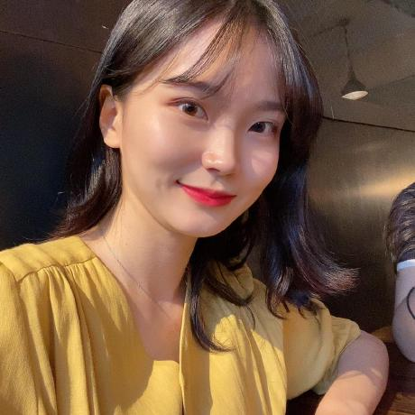
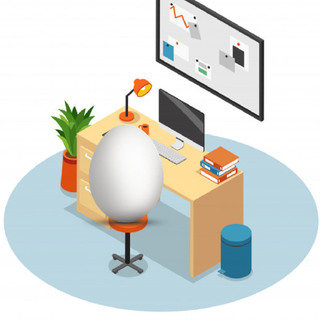
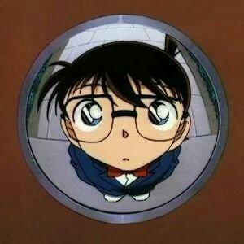
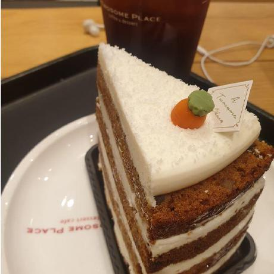

# 자바 알고리즘          

## 브루트포스

- [A+B-7](https://www.acmicpc.net/problem/11021)         
- [블랙잭](https://www.acmicpc.net/problem/2798)         
- [한수](https://www.acmicpc.net/problem/1065)       
- [덩치](https://www.acmicpc.net/problem/7568)       
- [체스판 다시 칠하기](https://www.acmicpc.net/problem/1018)        
- [오르막길](https://www.acmicpc.net/problem/2846)        
- [사탕게임](https://www.acmicpc.net/problem/3085)        
- [날짜계산](https://www.acmicpc.net/problem/1476)        
- [팰린드롬 만들기](https://www.acmicpc.net/problem/1254)        
- [분해합](https://www.acmicpc.net/problem/2231)        
- [영화감독숌](https://www.acmicpc.net/problem/1436)        
- [일곱 난쟁이](https://www.acmicpc.net/problem/2309)        

## 구현

- [그룹단어체커](https://www.acmicpc.net/problem/1316)         
- [주사위 굴리기](https://www.acmicpc.net/problem/14499)          
- [배열 돌리기 1](https://www.acmicpc.net/problem/16926)        
- [로봇 청소기](https://www.acmicpc.net/problem/14503)          
- [인구 이동](https://www.acmicpc.net/problem/16234)         

## 백트래킹(재귀)

- [피보나치 수 5](https://www.acmicpc.net/problem/10870)       
- [N과M(2)](https://www.acmicpc.net/problem/15650)      
- [스타트와링크](https://www.acmicpc.net/problem/14889)     
- [로또](https://www.acmicpc.net/problem/6603)      
- [하노이 탑 이동 순서](https://www.acmicpc.net/problem/11729)        
- [부분수열의 합](https://www.acmicpc.net/problem/1182)        
- [연산자 끼워넣기](https://www.acmicpc.net/problem/14888)        
- [퇴사](https://www.acmicpc.net/problem/14501)        
- [외판원 순회 2](https://www.acmicpc.net/problem/10971)       
- [부등호](https://www.acmicpc.net/problem/2529)       

## DFS&BFS

- [점프왕 쩰리(Small)](https://www.acmicpc.net/problem/16173)         
- [바이러스](https://www.acmicpc.net/problem/2606)         
- [미로 탐색](https://www.acmicpc.net/problem/2178)        
- [촌수계산](https://www.acmicpc.net/problem/2644)        
- [적록색약](https://www.acmicpc.net/problem/10026)        
- [치즈](https://www.acmicpc.net/problem/2638)       
- [두 동전](https://www.acmicpc.net/problem/16197)         
- [미로 만들기](https://www.acmicpc.net/problem/2665)        

## 우선순위큐

- [최소 힙](https://www.acmicpc.net/problem/1927)          
- [최대 힙](https://www.acmicpc.net/problem/11279)          
- [절댓값 힙](https://www.acmicpc.net/problem/11286)         
- [N번째 큰 수](https://www.acmicpc.net/problem/2075)         
- [강의실 배정](https://www.acmicpc.net/problem/11000)       
- [카드 합체 놀이](https://www.acmicpc.net/problem/15903)        
- [파일 합치기 3](https://www.acmicpc.net/problem/13975)       
- [센티와 마법의 뿅망치](https://www.acmicpc.net/problem/19638)          

## 투포인터 & 슬라이딩 윈도우

- [부분합](https://www.acmicpc.net/problem/1806)          
- [회전초밥](https://www.acmicpc.net/problem/15961)          
- [수들의 합 2](https://www.acmicpc.net/problem/2003)         
- [배열 합치기](https://www.acmicpc.net/problem/11728)          
- [두 용액](https://www.acmicpc.net/problem/2470)          
- [수 고르기](https://www.acmicpc.net/problem/2230)         
- [다이어트](https://www.acmicpc.net/problem/1484)        
- [게으른 백곰](https://www.acmicpc.net/problem/10025)          
- [소금과 후추(Small)](https://www.acmicpc.net/problem/14602)          

## DP

- [피보나치 함수](https://www.acmicpc.net/problem/1003)          
- [신나는 함수 실행](https://www.acmicpc.net/problem/9184)          
- [암호코드](https://www.acmicpc.net/problem/2011)          
- [전깃줄](https://www.acmicpc.net/problem/2565)         
- [1학년](https://www.acmicpc.net/problem/5557)          
- [포도주 시식](https://www.acmicpc.net/problem/2156)         
- [1, 2, 3 더하기 3](https://www.acmicpc.net/problem/15988)          
- [안녕](https://www.acmicpc.net/problem/1535)         
- [1, 2, 3 더하기 5](https://www.acmicpc.net/problem/15990)          
- [LCS](https://www.acmicpc.net/problem/9251)         
- [평범한 배낭](https://www.acmicpc.net/problem/12865)         
- [동물원](https://www.acmicpc.net/problem/1309)        
- [계단오르기](https://www.acmicpc.net/problem/2579)         
- [2xn 타일링](https://www.acmicpc.net/problem/11726)         
- [기타리스트](https://www.acmicpc.net/problem/1495)         
- [내려가기](https://www.acmicpc.net/problem/2096)          

## 다익스트라

- [최단경로](https://www.acmicpc.net/problem/1753)       
- [최소비용 구하기](https://www.acmicpc.net/problem/1916)         
- [알고스팟](https://www.acmicpc.net/problem/1261)          
- [녹색 옷 입은 애가 젤다지?](https://www.acmicpc.net/problem/4485)          

## 벨만포드

- [타임머신](https://www.acmicpc.net/problem/11657)         
- [웜홀](https://www.acmicpc.net/problem/1865)        

## 플로이드 워셜

- [경로찾기](https://www.acmicpc.net/problem/11403)          
- [회장뽑기](https://www.acmicpc.net/problem/2660)          

## MST

- [네트워크 연결](https://www.acmicpc.net/problem/1922)          
- [전력난](https://www.acmicpc.net/problem/6497)      
- [도시 분할 계획](https://www.acmicpc.net/problem/1647)         
- [별자리 만들기](https://www.acmicpc.net/problem/4386)        

## 유니온파인드

- [여행 가자](https://www.acmicpc.net/problem/1976)          
- [집합의 표현](https://www.acmicpc.net/problem/1717)        
- [친구 네트워크](https://www.acmicpc.net/problem/4195)        

## 이분탐색

- [공유기 설치](https://www.acmicpc.net/problem/2110)         
- [중량제한](https://www.acmicpc.net/problem/1939)        

- [산타로부터의 선물](https://www.acmicpc.net/problem/23635)  

- [이 쿠키 달지 않아!](https://www.acmicpc.net/problem/2031)       

## LCA(최소 공통 조상)

- [가장 가까운 공통 조상](https://www.acmicpc.net/problem/3584)         
- [LCA2](https://www.acmicpc.net/problem/11438)       
- [K진 트리](https://www.acmicpc.net/problem/11812)       

## 위상정렬

- [줄 세우기](https://www.acmicpc.net/problem/2252)       
- [음악프로그램](https://www.acmicpc.net/problem/2623)        
- [작업](https://www.acmicpc.net/problem/2056)       
- [영우는 사기꾼?](https://www.acmicpc.net/problem/14676)        
- [왕위 계승](https://www.acmicpc.net/problem/5021)     
- [게임 개발](https://www.acmicpc.net/problem/1516)       
- [선수과목](https://www.acmicpc.net/problem/14567)       
- [문제집](https://www.acmicpc.net/problem/1766)     

## 누적합

- [수열](https://www.acmicpc.net/problem/2559)          
- [Maximum Subarray](https://www.acmicpc.net/problem/10211)          
- [개똥벌레](https://www.acmicpc.net/problem/3020)          
- [수들의 합4](https://www.acmicpc.net/problem/2015)         
- [나머지 합](https://www.acmicpc.net/problem/10986)          
- [소형기관차](https://www.acmicpc.net/problem/2616)         
- [두 배열의 합](https://www.acmicpc.net/problem/2143)          

## 비트 마스킹

- [중복 제거](https://www.acmicpc.net/problem/13701)          
- [IP주소](https://www.acmicpc.net/problem/2064)    
- [막대기](https://www.acmicpc.net/problem/1094)       
- [외판원 순회](https://www.acmicpc.net/problem/2098)     
- [성곽](https://www.acmicpc.net/problem/2234)     

## KMP

- [부분 문자열](https://www.acmicpc.net/problem/16916)          
- [Cubeditor](https://www.acmicpc.net/problem/1701)        

- [나는 친구가 적다 (Large)](https://www.acmicpc.net/problem/16172)      

## 세그먼트 트리 & 펜윅 트리

- [구간 합 구하기](https://www.acmicpc.net/problem/2042)      
- [구간 곱 구하기](https://www.acmicpc.net/problem/11505)        

- [최솟값과 최댓값](https://www.acmicpc.net/problem/2357)    
- [최솟값](https://www.acmicpc.net/problem/10868)     

- [음주코딩](https://www.acmicpc.net/problem/5676)     
- [사탕상자](https://www.acmicpc.net/problem/2243)    

# 과제

## 220123~25.8시 : [사탕상자](https://www.acmicpc.net/problem/2243)

## 220122~24.8시 : [음주코딩](https://www.acmicpc.net/problem/5676)

## 220121~23.8시 : [최솟값](https://www.acmicpc.net/problem/10868)

## 220120~22.8시 : [최솟값과 최댓값](https://www.acmicpc.net/problem/2357)

## 220119~21.8시 : [구간 곱 구하기](https://www.acmicpc.net/problem/11505)

## 220118~20.8시 : [구간 합 구하기](https://www.acmicpc.net/problem/2042)

## 220117~19.8시 : [나는 친구가 적다 (Large)](https://www.acmicpc.net/problem/16172)

## 220116~18.8시 : [성곽](https://www.acmicpc.net/problem/2234)

## 220115~17.8시 : [외판원 순회](https://www.acmicpc.net/problem/2098)

## 220114~16.8시 : [Cubeditor](https://www.acmicpc.net/problem/1701)

## 220113~15.8시 : [IP주소](https://www.acmicpc.net/problem/2064)

## 220112~14.8시 : [막대기](https://www.acmicpc.net/problem/1094)

## 220111~13.8시 : [중복 제거](https://www.acmicpc.net/problem/13701)

## 220110~12.8시 : [부분 문자열](https://www.acmicpc.net/problem/16916)

## 220109~11.8시 : [두 배열의 합](https://www.acmicpc.net/problem/2143)

## 220108~10.8시 : [소형기관차](https://www.acmicpc.net/problem/2616)

## 220107~09.8시 : [나머지 합](https://www.acmicpc.net/problem/10986)

## 220106~08.8시 : [수들의 합4](https://www.acmicpc.net/problem/2015)

## 220105~07.8시 : [개똥벌레](https://www.acmicpc.net/problem/3020)

## 220104~06.8시 : [수열](https://www.acmicpc.net/problem/2559), [Maximum Subarray](https://www.acmicpc.net/problem/10211)

## 220103~05.8시 : [문제집](https://www.acmicpc.net/problem/1766)

## 220102~04.8시 : [선수과목](https://www.acmicpc.net/problem/14567)

## 220101~03.8시 : [게임 개발](https://www.acmicpc.net/problem/1516)

## 21년도

## 211019~22.8시 : [A+B-7](https://www.acmicpc.net/problem/11021), [블랙잭](https://www.acmicpc.net/problem/2798)

## 211020~22.8시: [한수](https://www.acmicpc.net/problem/1065), [덩치](https://www.acmicpc.net/problem/7568)

## 211021~23.8시: [체스판 다시 칠하기](https://www.acmicpc.net/problem/1018), [오르막길](https://www.acmicpc.net/problem/2846)

## 211022~24.8시: [사탕게임](https://www.acmicpc.net/problem/3085), [날짜계산](https://www.acmicpc.net/problem/1476)

## 211023~25.8시: [그룹단어체커](https://www.acmicpc.net/problem/1316), [팰린드롬 만들기](https://www.acmicpc.net/problem/1254)

## 211024~26.8시: [피보나치 수 5](https://www.acmicpc.net/problem/10870), [N과M(2)](https://www.acmicpc.net/problem/15650)

## 211025~27.8시: [스타트와링크](https://www.acmicpc.net/problem/14889), [로또](https://www.acmicpc.net/problem/6603)

## 211026~28.8시: [분해합](https://www.acmicpc.net/problem/2231), [하노이 탑 이동 순서](https://www.acmicpc.net/problem/11729)

## 211027~29.8시: [영화감독숌](https://www.acmicpc.net/problem/1436)

## 211028~30.8시: [부분수열의 합](https://www.acmicpc.net/problem/1182), [연산자 끼워넣기](https://www.acmicpc.net/problem/14888)

## 211029~31.8시: [퇴사](https://www.acmicpc.net/problem/14501), [일곱 난쟁이](https://www.acmicpc.net/problem/2309)

## 211030~1101.8시: [외판원 순회 2](https://www.acmicpc.net/problem/10971)

## 211031~1102.8시 : [부등호](https://www.acmicpc.net/problem/2529)

## 211101~1103.8시 : [점프왕 쩰리(Small)](https://www.acmicpc.net/problem/16173), [바이러스](https://www.acmicpc.net/problem/2606)

## 211102~1104.8시 : [미로 탐색](https://www.acmicpc.net/problem/2178)

## 211103~05.8시 : [촌수계산](https://www.acmicpc.net/problem/2644)

## 211104~06.8시 : [적록색약](https://www.acmicpc.net/problem/10026)

## 211105~07.8시 : [치즈](https://www.acmicpc.net/problem/2638)

## 211106~08.8시 : [두 동전](https://www.acmicpc.net/problem/16197)

## 211107~09.8시 : [미로만들기](https://www.acmicpc.net/problem/2665)

## 211108~10.8시 : [최소 힙](https://www.acmicpc.net/problem/1927), [최대 힙](https://www.acmicpc.net/problem/11279)

## 201109~11.8시 : [절댓값 힙](https://www.acmicpc.net/problem/11286)

## 201110~12.8시 : [N번째 큰 수](https://www.acmicpc.net/problem/2075)

## 201111~13.8시 : [강의실 배정](https://www.acmicpc.net/problem/11000)

## 201112~14.8시 : [카드 합체 놀이](https://www.acmicpc.net/problem/15903)

## 201113~15.8시 : [파일 합치기 3](https://www.acmicpc.net/problem/13975)

## 201114~16.8시 : [센티와 마법의 뿅망치](https://www.acmicpc.net/problem/19638)

## 201115~17.8시 : [부분합](https://www.acmicpc.net/problem/1806)

## 201116~18.8시 : [회전초밥](https://www.acmicpc.net/problem/15961)

## 201117~19.8시 : [수들의 합 2](https://www.acmicpc.net/problem/2003), [배열 합치기](https://www.acmicpc.net/problem/11728)

## 201118~20.8시 : [두 용액](https://www.acmicpc.net/problem/2470)

## 211119~21.8시 : [수 고르기](https://www.acmicpc.net/problem/2230)

## 211120~22.8시 : [다이어트](https://www.acmicpc.net/problem/1484)

## 211121~23.8시 : [게으른 백곰](https://www.acmicpc.net/problem/10025), [소금과 후추(Small)](https://www.acmicpc.net/problem/14602)

## 211122~24.8시 : [피보나치 함수](https://www.acmicpc.net/problem/1003), [신나는 함수 실행](https://www.acmicpc.net/problem/9184)

## 211123~25.8시 : [암호코드](https://www.acmicpc.net/problem/2011), [전깃줄](https://www.acmicpc.net/problem/2565)

## 211124~26.8시 : [1학년](https://www.acmicpc.net/problem/5557)

## 211125~27.8시 : [포도주 시식](https://www.acmicpc.net/problem/2156), [1, 2, 3 더하기 3](https://www.acmicpc.net/problem/15988)

## 211126~28.8시 : [안녕](https://www.acmicpc.net/problem/1535), [1, 2, 3 더하기 5](https://www.acmicpc.net/problem/15990)

## 211127~29.8시 : [LCS](https://www.acmicpc.net/problem/9251)

## 211128~30.8시 : [평범한 배낭](https://www.acmicpc.net/problem/12865)

## 211129~01.8시 : [주사위 굴리기](https://www.acmicpc.net/problem/14499)

## 211130~02.8시 : [배열 돌리기 1](https://www.acmicpc.net/problem/16926), [동물원](https://www.acmicpc.net/problem/1309)

## 211201~03.8시 : [계단오르기](https://www.acmicpc.net/problem/2579), [2xn 타일링](https://www.acmicpc.net/problem/11726)

## 211202~04.8시 : [로봇 청소기](https://www.acmicpc.net/problem/14503)

## 211203~05.8시 : [인구 이동](https://www.acmicpc.net/problem/16234)

## 211204~06.8시 : [기타리스트](https://www.acmicpc.net/problem/1495)

## 211205~07.8시 : [내려가기](https://www.acmicpc.net/problem/2096)

## 211206~08.8시 : [최단경로](https://www.acmicpc.net/problem/1753)

## 211207~09.8시 : [최소비용 구하기](https://www.acmicpc.net/problem/1916)

## 211208~10.8시 : [타임머신](https://www.acmicpc.net/problem/11657)

## 211209~11.8시 : [알고스팟](https://www.acmicpc.net/problem/1261)

## 211210~12.8시 : [웜홀](https://www.acmicpc.net/problem/1865)

## 211211~13.8시 : [녹색 옷 입은 애가 젤다지?](https://www.acmicpc.net/problem/4485)

## 211212~14.8시 : [경로찾기](https://www.acmicpc.net/problem/11403), [회장뽑기](https://www.acmicpc.net/problem/2660)

## 211213~15.8시 : [여행 가자](https://www.acmicpc.net/problem/1976)

## 211214~16.8시 : [네트워크 연결](https://www.acmicpc.net/problem/1922)

## 211215~17.8시 : [집합의 표현](https://www.acmicpc.net/problem/1717)

## 211216~18.8시 : [친구 네트워크](https://www.acmicpc.net/problem/4195)

## 211217~19.8시 : [전력난](https://www.acmicpc.net/problem/6497)

## 211218~20.8시 : [도시 분할 계획](https://www.acmicpc.net/problem/1647)

## 211219~21.8시 : [별자리 만들기](https://www.acmicpc.net/problem/4386)

## 211220~22.8시 : [가장 가까운 공통 조상](https://www.acmicpc.net/problem/3584)

## 211221~23.8시 : [공유기 설치](https://www.acmicpc.net/problem/2110)

## 211222~24.8시 : [중량제한](https://www.acmicpc.net/problem/1939)

## 211223~25.8시 : [산타로부터의 선물](https://www.acmicpc.net/problem/23635)

## 211224~26.8시 : [이 쿠키 달지 않아!](https://www.acmicpc.net/problem/2031)

## 211225~27.8시 : [LCA2](https://www.acmicpc.net/problem/11438)

## 211226~28.8시 : [K진 트리](https://www.acmicpc.net/problem/11812)

## 211227~29.8시 : [줄 세우기](https://www.acmicpc.net/problem/2252)

## 211228~30.8시 : [음악프로그램](https://www.acmicpc.net/problem/2623)

## 211229~31.8시 : [작업](https://www.acmicpc.net/problem/2056)

## 211230~220101.8시 : [영우는 사기꾼?](https://www.acmicpc.net/problem/14676)

## 211231~220102.8시 : [왕위 계승](https://www.acmicpc.net/problem/5021)
