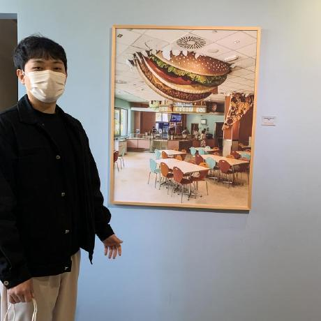
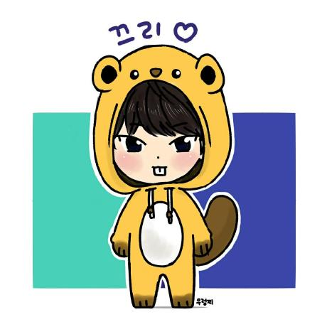

# 자바 알고리즘          

# 문제

프로그래머스 문제

- [다트게임](https://programmers.co.kr/learn/courses/30/lessons/17682)   

- [비밀지도](https://programmers.co.kr/learn/courses/30/lessons/17681)   

- [방금그곡](https://programmers.co.kr/learn/courses/30/lessons/17683)   

- [압축](https://programmers.co.kr/learn/courses/30/lessons/17684)   

- [파일명 정렬](https://programmers.co.kr/learn/courses/30/lessons/17686)      

- [k진수에서 소수 개수 구하기](https://programmers.co.kr/learn/courses/30/lessons/92335)     

- [수식 최대화](https://programmers.co.kr/learn/courses/30/lessons/67257)    

- [타겟 넘버](https://programmers.co.kr/learn/courses/30/lessons/43165)     

- [튜플](https://programmers.co.kr/learn/courses/30/lessons/64065)    

- [문자열 압축](https://programmers.co.kr/learn/courses/30/lessons/60057)     

- [오픈채팅방](https://programmers.co.kr/learn/courses/30/lessons/42888)       

- [배달](https://programmers.co.kr/learn/courses/30/lessons/12978)      

- [게임 맵 최단거리](https://programmers.co.kr/learn/courses/30/lessons/1844)        

- [키패드 누르기](https://programmers.co.kr/learn/courses/30/lessons/67256)     

- [거리두기 확인하기](https://programmers.co.kr/learn/courses/30/lessons/81302)     

- [보석 쇼핑](https://programmers.co.kr/learn/courses/30/lessons/67258)     

- [로또의 최고 순위와 최저 순위](https://programmers.co.kr/learn/courses/30/lessons/77484)    

- [행렬 테두리 회전하기](https://programmers.co.kr/learn/courses/30/lessons/77485)    

- [다단계 칫솔 판매](https://programmers.co.kr/learn/courses/30/lessons/77486)     

- [2 x n 타일링](https://programmers.co.kr/learn/courses/30/lessons/12900)     

- [불량 사용자](https://programmers.co.kr/learn/courses/30/lessons/64064)     

- [양궁 대회](https://programmers.co.kr/learn/courses/30/lessons/92342)    

- [스킬 트리](https://programmers.co.kr/learn/courses/30/lessons/49993)     

- [후보 키](https://programmers.co.kr/learn/courses/30/lessons/42890)     

- [점프와 순간이동](https://programmers.co.kr/learn/courses/30/lessons/12980)    

- [광고 삽입](https://programmers.co.kr/learn/courses/30/lessons/72414)     

- [합승 택시 요금](https://programmers.co.kr/learn/courses/30/lessons/72413)      

- [카드 짝 맞추기](https://programmers.co.kr/learn/courses/30/lessons/72415)    

- [주차 요금 계산](https://programmers.co.kr/learn/courses/30/lessons/92341)    

- [124 나라의 숫자](https://programmers.co.kr/learn/courses/30/lessons/12899)      

- [괄호 회전하기](https://programmers.co.kr/learn/courses/30/lessons/76502)     

- [다리를 지나는 트럭](https://programmers.co.kr/learn/courses/30/lessons/42583)      

- [H-Index](https://programmers.co.kr/learn/courses/30/lessons/42747)       

- [괄호 변환](https://programmers.co.kr/learn/courses/30/lessons/60058)       

- [전화번호 목록](https://programmers.co.kr/learn/courses/30/lessons/42577)       

- [예상 대진표](https://programmers.co.kr/learn/courses/30/lessons/12985)      

- [[1차] 뉴스 클러스터링](https://programmers.co.kr/learn/courses/30/lessons/17677)      

- [신규 아이디 추천](https://programmers.co.kr/learn/courses/30/lessons/72410)      

- [영어 끝말잇기](https://programmers.co.kr/learn/courses/30/lessons/12981)      

- [단체사진 찍기](https://programmers.co.kr/learn/courses/30/lessons/1835)      

- [피로도](https://programmers.co.kr/learn/courses/30/lessons/87946)      

- [JadenCase 문자열 만들기](https://programmers.co.kr/learn/courses/30/lessons/12951)      

- [행렬의 곱셈](https://programmers.co.kr/learn/courses/30/lessons/12949)       

- [메뉴 리뉴얼](https://programmers.co.kr/learn/courses/30/lessons/72411)       

- [카카오프렌즈 컬러링북](https://programmers.co.kr/learn/courses/30/lessons/1829)     

- [방문 길이](https://programmers.co.kr/learn/courses/30/lessons/49994)     

- [[1차] 캐시](https://programmers.co.kr/learn/courses/30/lessons/17680)      

- [순위 검색](https://programmers.co.kr/learn/courses/30/lessons/72412)       

- [[1차] 프렌즈4블록](https://programmers.co.kr/learn/courses/30/lessons/17679)      

- [더 맵게](https://programmers.co.kr/learn/courses/30/lessons/42626)        

- [기능개발](https://programmers.co.kr/learn/courses/30/lessons/42586)        

- [빛의 경로 사이클](https://programmers.co.kr/learn/courses/30/lessons/86052)      

- [n진수 게임](https://programmers.co.kr/learn/courses/30/lessons/17687)        

- [멀쩡한 사각형](https://programmers.co.kr/learn/courses/30/lessons/62048)      

- [카펫](https://programmers.co.kr/learn/courses/30/lessons/42842)    

- [구명보트](https://programmers.co.kr/learn/courses/30/lessons/42885)       

- [교점에 별 만들기](https://programmers.co.kr/learn/courses/30/lessons/87377)       

- [디스크 컨트롤러](https://programmers.co.kr/learn/courses/30/lessons/42627)      

- [등굣길](https://programmers.co.kr/learn/courses/30/lessons/42898)     

- [사라지는 발판](https://programmers.co.kr/learn/courses/30/lessons/92345)     

- [쿼드압축 후 개수 세기](https://programmers.co.kr/learn/courses/30/lessons/68936)        

- [가장 큰 정사각형 찾기](https://programmers.co.kr/learn/courses/30/lessons/12905)         

- [단어 변환](https://programmers.co.kr/learn/courses/30/lessons/43163)   

- [입국심사](https://programmers.co.kr/learn/courses/30/lessons/43238)       

- [N으로 표현](https://programmers.co.kr/learn/courses/30/lessons/42895)     

- [파괴되지 않은 건물](https://programmers.co.kr/learn/courses/30/lessons/92344)      

- [미로 탈출](https://programmers.co.kr/learn/courses/30/lessons/81304)  

- [양과 늑대](https://programmers.co.kr/learn/courses/30/lessons/92343)  

- [길 찾기 게임](https://programmers.co.kr/learn/courses/30/lessons/42892)    

- [경주로 건설](https://programmers.co.kr/learn/courses/30/lessons/67259)    

- [금과 은 운반하기](https://programmers.co.kr/learn/courses/30/lessons/86053)   

- [스티커 모으기(2)](https://programmers.co.kr/learn/courses/30/lessons/12971)   

- [풍선 터뜨리기](https://programmers.co.kr/learn/courses/30/lessons/68646)  

- [호텔 방 배정](https://programmers.co.kr/learn/courses/30/lessons/64063) 

- [네트워크](https://programmers.co.kr/learn/courses/30/lessons/43162) 
  

백준 문제

- [퍼즐](https://www.acmicpc.net/problem/1525)     

- [등산 마니아](https://www.acmicpc.net/problem/20188)       

- [숫자구슬](https://www.acmicpc.net/problem/2613)       

- [연구소](https://www.acmicpc.net/problem/14502)     

- [주사위 굴리기](https://www.acmicpc.net/problem/14499)     

- [인구 이동](https://www.acmicpc.net/problem/16234)      

- [나무 재테크](https://www.acmicpc.net/problem/16235)        

- [아기 상어](https://www.acmicpc.net/problem/16236)     

- [미세먼지 안녕!](https://www.acmicpc.net/problem/17144)     

- [청소년 상어](https://www.acmicpc.net/problem/19236)       

- [어른 상어](https://www.acmicpc.net/problem/19237)    

- [상어 초등학교](https://www.acmicpc.net/problem/21608)        

- [상어 중학교](https://www.acmicpc.net/problem/21609)     

- [마법사 상어와 비바라기](https://www.acmicpc.net/problem/21610)       

- [마법사 상어와 블리자드](https://www.acmicpc.net/problem/21611)  

- [앱](https://www.acmicpc.net/problem/7579)       

- [동전](https://www.acmicpc.net/problem/2293)        

- [테트로미노](https://www.acmicpc.net/problem/14500)      

- [치킨 배달](https://www.acmicpc.net/problem/15686)      

- [로봇](https://www.acmicpc.net/problem/1726)     

- [낚시왕](https://www.acmicpc.net/problem/17143)       
- [게리맨더링 2](https://www.acmicpc.net/problem/17779)      
- [경사로](https://www.acmicpc.net/problem/14890)   
- [스타트 택시](https://www.acmicpc.net/problem/19238)     
- [이차원 배열과 연산](https://www.acmicpc.net/problem/17140)     
- [연구소 3](https://www.acmicpc.net/problem/17142)     
- [톱니바퀴](https://www.acmicpc.net/problem/14891)    
- [퇴사](https://www.acmicpc.net/problem/14501)    
- [LCS](https://www.acmicpc.net/problem/9251) 
- [암호코드](https://www.acmicpc.net/problem/2011)   
- [빙산](https://www.acmicpc.net/problem/2573)   
- [색종이 붙이기](https://www.acmicpc.net/problem/17136)    
- [가르침](https://www.acmicpc.net/problem/1062)    
- [통나무 옮기기](https://www.acmicpc.net/problem/1938)   
- [puyo puyo](https://www.acmicpc.net/problem/11559)  
- [스도쿠](https://www.acmicpc.net/problem/2239)   
- [배열 돌리기 4](https://www.acmicpc.net/problem/17406)   
- [원판 돌리기](https://www.acmicpc.net/problem/17822)   
- [주사위 굴리기 2](https://www.acmicpc.net/problem/23288)  
- [구간 합 구하기 5](https://www.acmicpc.net/problem/11660)   
- [개똥벌레](https://www.acmicpc.net/problem/3020)   
- [문자열 폭발](https://www.acmicpc.net/problem/9935)   
- [감시](https://www.acmicpc.net/problem/15683)    
- [드래곤 커브](https://www.acmicpc.net/problem/15685)  
- [어두운 건 무서워](https://www.acmicpc.net/problem/16507)    
- [약수의 합](https://www.acmicpc.net/problem/17425)    
- [리조트](https://www.acmicpc.net/problem/13302)   
- [오타](https://www.acmicpc.net/problem/5875)   
- [행성 터널](https://www.acmicpc.net/problem/2887)   
- [소가 길을 건너간 이유 8](https://www.acmicpc.net/problem/14462)   
- [유전자](https://www.acmicpc.net/problem/2306)   
- [가운데를 말해요](https://www.acmicpc.net/problem/1655)   
- [소형기관차](https://www.acmicpc.net/problem/2616)  
- [직사각형으로 나누기](https://www.acmicpc.net/problem/1451)    
- [강의실 배정](https://www.acmicpc.net/problem/11000)    
- [해킹](https://www.acmicpc.net/problem/10282)  
- [당근 훔쳐 먹기](https://www.acmicpc.net/problem/18234)    
- [순회강연](https://www.acmicpc.net/problem/2109)    
- [미친 로봇](https://www.acmicpc.net/problem/1405)   
- [피자 오븐](https://www.acmicpc.net/problem/19940)   
- [욕심쟁이 판다](https://www.acmicpc.net/problem/1937)  
- [가장 큰 정사각형](https://www.acmicpc.net/problem/1915)    
- [움직이는 미로 탈출](https://www.acmicpc.net/problem/16954)  
- [작업](https://www.acmicpc.net/problem/2056)
- [게임 개발](https://www.acmicpc.net/problem/1516)

  

# 과제

6월

## 02~04.8시 : [게임 개발](https://www.acmicpc.net/problem/1516)

## 01~03.8시 : [작업](https://www.acmicpc.net/problem/2056)

5월

## 31~02.8시 : [네트워크](https://programmers.co.kr/learn/courses/30/lessons/43162)

## 30~01.8시 : [움직이는 미로 탈출](https://www.acmicpc.net/problem/16954)

## 29~31.8시 : [가장 큰 정사각형](https://www.acmicpc.net/problem/1915)

## 28~30.8시 : [욕심쟁이 판다](https://www.acmicpc.net/problem/1937)

## 27~29.8시 : [호텔 방 배정](https://programmers.co.kr/learn/courses/30/lessons/64063)

## 26~28.8시 : [풍선 터뜨리기](https://programmers.co.kr/learn/courses/30/lessons/68646)

## 25~27.8시 : [피자 오븐](https://www.acmicpc.net/problem/19940)

## 24~26.8시 : [미친 로봇](https://www.acmicpc.net/problem/1405)

## 23~25.8시 : [순회강연](https://www.acmicpc.net/problem/2109)

## 22~24.8시 : [당근 훔쳐 먹기](https://www.acmicpc.net/problem/18234)

## 21~23.8시 : [해킹](https://www.acmicpc.net/problem/10282)

## 20~22.8시 : [강의실 배정](https://www.acmicpc.net/problem/11000)

## 19~21.8시 : [스티커 모으기(2)](https://programmers.co.kr/learn/courses/30/lessons/12971)

## 18~20.8시 : [금과 은 운반하기](https://programmers.co.kr/learn/courses/30/lessons/86053)

## 17~19.8시 : [직사각형으로 나누기](https://www.acmicpc.net/problem/1451)

## 16~18.8시 : [소형기관차](https://www.acmicpc.net/problem/2616)

## 15~17.8시 : [가운데를 말해요](https://www.acmicpc.net/problem/1655)

## 14~16.8시 : [유전자](https://www.acmicpc.net/problem/2306)  

## 13~15.8시 : [소가 길을 건너간 이유 8](https://www.acmicpc.net/problem/14462)

## 12~14.8시 : [행성 터널](https://www.acmicpc.net/problem/2887)

## 11~13.8시 : [오타](https://www.acmicpc.net/problem/5875)

## 10~12.8시 : [리조트](https://www.acmicpc.net/problem/13302)

## 09~11.8시 : [약수의 합](https://www.acmicpc.net/problem/17425)

## 08~10.8시: [어두운 건 무서워](https://www.acmicpc.net/problem/16507)

## 07~09.8시: [드래곤 커브](https://www.acmicpc.net/problem/15685)

## 06~08.8시: [감시](https://www.acmicpc.net/problem/15683)

## 05~07.8시: [문자열 폭발](https://www.acmicpc.net/problem/9935)

## 04~06.8시: [구간 합 구하기 5](https://www.acmicpc.net/problem/11660), [개똥벌레](https://www.acmicpc.net/problem/3020)

## 03~05.8시: [경주로 건설](https://programmers.co.kr/learn/courses/30/lessons/67259)

## 02~04.8시: [길 찾기 게임](https://programmers.co.kr/learn/courses/30/lessons/42892)

## 01~03.8시: [주사위 굴리기 2](https://www.acmicpc.net/problem/23288)

4월

## 30~02.8시 : [원판 돌리기](https://www.acmicpc.net/problem/17822) 

## 29~01.8시 : [배열 돌리기 4](https://www.acmicpc.net/problem/17406)

## 28~30.8시 : [스도쿠](https://www.acmicpc.net/problem/2239)

## 27~29.8시 : [puyo puyo](https://www.acmicpc.net/problem/11559)

## 26~28.8시 : [통나무 옮기기](https://www.acmicpc.net/problem/1938)

## 25~27.8시 : [양과 늑대](https://programmers.co.kr/learn/courses/30/lessons/92343)

## 24~26.8시 : [가르침](https://www.acmicpc.net/problem/1062)

## 23~25.8시 : [색종이 붙이기](https://www.acmicpc.net/problem/17136)  

## 22~24.8시 : [빙산](https://www.acmicpc.net/problem/2573)   

## 21~23.8시 : [암호코드](https://www.acmicpc.net/problem/2011)

## 20~22.8시 : [LCS](https://www.acmicpc.net/problem/9251)

## 19~21.8시 : [미로 탈출](https://programmers.co.kr/learn/courses/30/lessons/81304)

## 18~20.8시 : [파괴되지 않은 건물](https://programmers.co.kr/learn/courses/30/lessons/92344)

## 17~19.8시 : [톱니바퀴](https://www.acmicpc.net/problem/14891)

## 16~18.8시 : [퇴사](https://www.acmicpc.net/problem/14501)

## 15~17.8시 : [연구소 3](https://www.acmicpc.net/problem/17142)

## 14~16.8시 : [이차원 배열과 연산](https://www.acmicpc.net/problem/17140)

## 13~15.8시 : [스타트 택시](https://www.acmicpc.net/problem/19238)

## 12~14.8시 : [경사로](https://www.acmicpc.net/problem/14890)

## 11~13.8시 : [N으로 표현](https://programmers.co.kr/learn/courses/30/lessons/42895)

## 10~12.8시 : [입국심사](https://programmers.co.kr/learn/courses/30/lessons/43238)

## 09~11.8시 : [게리맨더링 2](https://www.acmicpc.net/problem/17779)

## 08~10.8시 : [낚시왕](https://www.acmicpc.net/problem/17143)

## 07~09.8시 : [로봇](https://www.acmicpc.net/problem/1726)

## 06~08.8시 : [단어 변환](https://programmers.co.kr/learn/courses/30/lessons/43163)

## 05~07.8시 : [치킨 배달](https://www.acmicpc.net/problem/15686)

## 04~06.8시 : [테트로미노](https://www.acmicpc.net/problem/14500)

## 03~05.8시 : [동전](https://www.acmicpc.net/problem/2293)

## 02~04.8시 : [쿼드압축 후 개수 세기](https://programmers.co.kr/learn/courses/30/lessons/68936), [가장 큰 정사각형 찾기](https://programmers.co.kr/learn/courses/30/lessons/12905)

## 01~03.8시 : [앱](https://www.acmicpc.net/problem/7579)

3월

## 0331~02.8시 : [마법사 상어와 블리자드](https://www.acmicpc.net/problem/21611)

## 0330~01.8시 : [마법사 상어와 비바라기](https://www.acmicpc.net/problem/21610)

## 0329~31.8시 : [사라지는 발판](https://programmers.co.kr/learn/courses/30/lessons/92345)

## 0328~30.8시 : [상어 중학교](https://www.acmicpc.net/problem/21609)

## 0327~29.8시 : [상어 초등학교](https://www.acmicpc.net/problem/21608)

## 0326~28.8시 : [어른 상어](https://www.acmicpc.net/problem/19237)

## 0325~27.8시 : [청소년 상어](https://www.acmicpc.net/problem/19236)

## 0324~26.8시 : [미세먼지 안녕!](https://www.acmicpc.net/problem/17144)

## 0323~25.8시 : [아기 상어](https://www.acmicpc.net/problem/16236)

## 0322~24.8시 : [등굣길](https://programmers.co.kr/learn/courses/30/lessons/42898)

## 0321~23.8시 : [디스크 컨트롤러](https://programmers.co.kr/learn/courses/30/lessons/42627)

## 0320~22.8시 : [나무 재테크](https://www.acmicpc.net/problem/16235)

## 0319~21.8시 : [인구 이동](https://www.acmicpc.net/problem/16234)

## 0318~20.8시 : [주사위 굴리기](https://www.acmicpc.net/problem/14499)

## 0317~19.8시 : [연구소](https://www.acmicpc.net/problem/14502)

## 0316~18.8시 : [숫자구슬](https://www.acmicpc.net/problem/2613)

## 0315~17.8시: [등산 마니아](https://www.acmicpc.net/problem/20188)

## 0314~16.8시: [퍼즐](https://www.acmicpc.net/problem/1525)

## 0313~15.8시: [구명보트](https://programmers.co.kr/learn/courses/30/lessons/42885), [교점에 별 만들기](https://programmers.co.kr/learn/courses/30/lessons/87377)

## 0312~14.8시: [카펫](https://programmers.co.kr/learn/courses/30/lessons/42842)

## 0311~13.8시: [멀쩡한 사각형](https://programmers.co.kr/learn/courses/30/lessons/62048)

## 0310~12.8시: [n진수 게임](https://programmers.co.kr/learn/courses/30/lessons/17687)

## 0309~11.8시: [빛의 경로 사이클](https://programmers.co.kr/learn/courses/30/lessons/86052)

## 0308~10.8시: [기능개발](https://programmers.co.kr/learn/courses/30/lessons/42586)

## 0307~09.8시: [더 맵게](https://programmers.co.kr/learn/courses/30/lessons/42626)

## 0306~08.8시: [[1차]프렌즈4블록](https://programmers.co.kr/learn/courses/30/lessons/17679)

## 0305~07.8시: [순위 검색](https://programmers.co.kr/learn/courses/30/lessons/72412)

## 0304~06.8시: [[1차] 캐시](https://programmers.co.kr/learn/courses/30/lessons/17680)

## 0303~05.8시: [방문 길이](https://programmers.co.kr/learn/courses/30/lessons/49994)

## 0302~04.8시: [카카오프렌즈 컬러링북](https://programmers.co.kr/learn/courses/30/lessons/1829)

## 0301~03.8시: [메뉴 리뉴얼](https://programmers.co.kr/learn/courses/30/lessons/72411)

2월

## 0228~02.8시: [행렬의 곱셈](https://programmers.co.kr/learn/courses/30/lessons/12949)

## 0227~01.8시: [JadenCase 문자열 만들기](https://programmers.co.kr/learn/courses/30/lessons/12951)

## 0226~28.8시: [피로도](https://programmers.co.kr/learn/courses/30/lessons/87946)

## 0225~27.8시: [단체사진 찍기](https://programmers.co.kr/learn/courses/30/lessons/1835)

## 0224~26.8시: [신규 아이디 추천](https://programmers.co.kr/learn/courses/30/lessons/72410), [영어 끝말잇기](https://programmers.co.kr/learn/courses/30/lessons/12981)

## 0223~25.8시: [[1차] 뉴스 클러스터링](https://programmers.co.kr/learn/courses/30/lessons/17677)

## 0222~24.8시: [전화번호 목록](https://programmers.co.kr/learn/courses/30/lessons/42577), [예상 대진표](https://programmers.co.kr/learn/courses/30/lessons/12985)

## 0221~23.8시: [괄호 변환](https://programmers.co.kr/learn/courses/30/lessons/60058)

## 0220~22.8시: [H-Index](https://programmers.co.kr/learn/courses/30/lessons/42747)

## 0219~21.8시: [다리를 지나는 트럭](https://programmers.co.kr/learn/courses/30/lessons/42583)

## 0218~20.8시: [괄호 회전하기](https://programmers.co.kr/learn/courses/30/lessons/76502)

## 0217~19.8시: [124 나라의 숫자](https://programmers.co.kr/learn/courses/30/lessons/12899)

## 0216~18.8시 : [주차 요금 계산](https://programmers.co.kr/learn/courses/30/lessons/92341)

## 0215~17.8시 : [카드 짝 맞추기](https://programmers.co.kr/learn/courses/30/lessons/72415)

## 0214~16.8시 : [합승 택시 요금](https://programmers.co.kr/learn/courses/30/lessons/72413)

## 0213~15.8시 : [광고 삽입](https://programmers.co.kr/learn/courses/30/lessons/72414)

## 0212~14.8시 : [후보 키](https://programmers.co.kr/learn/courses/30/lessons/42890), [점프와 순간이동](https://programmers.co.kr/learn/courses/30/lessons/12980)

## 0211~13.8시 : [양궁 대회](https://programmers.co.kr/learn/courses/30/lessons/92342), [스킬 트리](https://programmers.co.kr/learn/courses/30/lessons/49993)

## 0210~12.8시 : [불량 사용자](https://programmers.co.kr/learn/courses/30/lessons/64064)

## 0209~11.8시 : [2 x n 타일링](https://programmers.co.kr/learn/courses/30/lessons/12900)

## 0208~10.8시 : [다단계 칫솔 판매](https://programmers.co.kr/learn/courses/30/lessons/77486)

## 0207~09.8시 : [로또의 최고 순위와 최저 순위](https://programmers.co.kr/learn/courses/30/lessons/77484), [행렬 테두리 회전하기](https://programmers.co.kr/learn/courses/30/lessons/77485)

## 0206~08.8시 : [보석 쇼핑](https://programmers.co.kr/learn/courses/30/lessons/67258)

## 0205~07.8시 : [키패드 누르기](https://programmers.co.kr/learn/courses/30/lessons/67256), [거리두기 확인하기](https://programmers.co.kr/learn/courses/30/lessons/81302)

## 0204~06.8시 : [게임 맵 최단거리](https://programmers.co.kr/learn/courses/30/lessons/1844)

## 0203~05.8시 : [배달](https://programmers.co.kr/learn/courses/30/lessons/12978)

## 0202~04.8시 : [오픈채팅방](https://programmers.co.kr/learn/courses/30/lessons/42888)

## 0201~03.8시 : [문자열 압축](https://programmers.co.kr/learn/courses/30/lessons/60057)

1월

## 220131~02.8시 : [튜플](https://programmers.co.kr/learn/courses/30/lessons/64065)

## 220130~01.8시 : [타겟 넘버](https://programmers.co.kr/learn/courses/30/lessons/43165)

## 220129~31.8시 : [수식 최대화](https://programmers.co.kr/learn/courses/30/lessons/67257)

## 220128~30.8시 : [k진수에서 소수 개수 구하기](https://programmers.co.kr/learn/courses/30/lessons/92335)

## 220127~29.8시 : [파일명 정렬](https://programmers.co.kr/learn/courses/30/lessons/17686)

## 220126~28.8시 : [압축](https://programmers.co.kr/learn/courses/30/lessons/17684)

## 220125~27.8시 : [방금그곡](https://programmers.co.kr/learn/courses/30/lessons/17683)

## 220124~26.8시 : [1차 다트게임](https://programmers.co.kr/learn/courses/30/lessons/17682), [1차 비밀지도](https://programmers.co.kr/learn/courses/30/lessons/17681)

